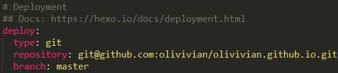

 

因为怎么搭建的教程已经有很多详细的文档了，所以我就不再写具体的搭建过程。而是写下大致流程、遇到的问题与相关链接推荐。对自己博客搭建做一个记录的同时也希望能对你有所帮助。

先放上：[官方文档](https://hexo.io/docs/index.html)

主要针对window操作系统，Mac可以参考[这里](http://huangnx.com/2016/03/17/BlogPlatByHexoAndGithub/)。

---
### 安装前准备:
#### 安装Node.js
 [Node.js安装教程](http://www.runoob.com/nodejs/nodejs-install-setup.html)
#### 安装Git
[git安装教程](http://www.cnblogs.com/shiy/p/6441552.html)
#### 注册github账号
[注册github教程（一）](https://jingyan.baidu.com/article/455a9950abe0ada167277864.html)
[注册github教程（二）](https://jingyan.baidu.com/article/ff42efa93b2ed6c19e22021c.html)
*注意：github的用户名一经注册就不能改变，所以起的时候尽量起些有意义的，当初注册的时候不知道随便起了一个名字，现在只能一直顶着这个名字了。用户名与昵称(Name)不同，昵称可以变化。*

---

前面的都弄清楚，就可以来搭建博客了
### 推荐教程
[史上最详细“截图”搭建Hexo博客并部署到Github](https://jingyan.baidu.com/article/d8072ac47aca0fec95cefd2d.html)

### 我搭建过程踩到的坑
1、创建仓库的时候注意Repository的名字，仓库名称格式必须是【github用户名.github.io】。*此处就体现出了起一个好的github用户名的好处，真是一把辛酸泪。*

2、_config.yml配置的时候，冒号后面一定要有一个空格。*当时因为这个问题，走了好多弯路*。还有就是`hexo`在2点几的版本中`type: github`。之后的版本是`type: git`。 

### 其它可能出现的问题：
  * 错误：执行`$hexo deloy`，提示`Error Deployer not found：git`
    解决：`$ npm install hexo-deployer-git --save`
  
### 结束语
 一般来说按照流程一步一步的走是不会出错的，但是，意外总是发生的猝不及防，如果你不幸踩到了什么奇怪的坑，那就只能Wish you good luck！

### 其它参考
> [《Hexo+github搭建个人博客》](http://www.cnblogs.com/dantefung/p/d8c48ba8030bcab7cfc364d423186fee.html)
[github帮助文档](https://help.github.com/)
[MarkDown简单入门](http://www.jianshu.com/p/e1cbc8b98aaf)

